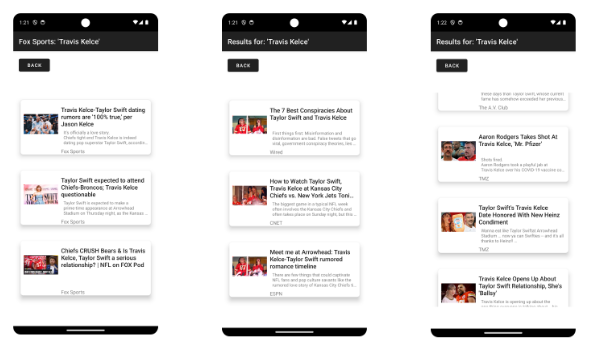
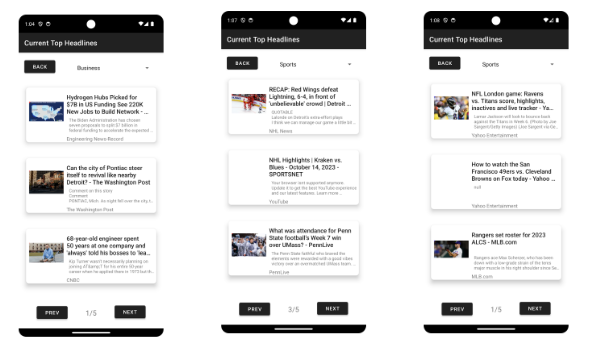

# Anroid News

GW 2023 project for CSCI4237 - Software Development for Handheld Devices by Damien Villegas

## Description

A news app that uses [NewsAPI](https://newsapi.org/) and [Google Maps API](https://developers.google.com/maps) to display current news articles in a variety of ways. You can view top headlines for common categories like 'health', 'sports', 'general', etc. Also, you can click a spot on Google Maps and get articles for that country. Lastly, you can search for specific terms and choose news from a specific source.

To run this app you will need (free) API keys from the links above. I've provided a tutorial to show how to set up Android News locally and where to put the API keys.

## Features

- Real news articles, pulled from a variety of sources
- Clicking articles takes you to a browser where you can read the articles
- Search for terms and pick sources (or choose no source)
- Explore news from around the world by clicking countries and scrolling through related articles
- Check out top headlines from various categories
- Network error handling, so the app won't crash if API calls fail
- Articles missing information (no image or description for example) will still display
- Data persistence using local storage so when you close the app and open it again your search term, map location, and top headlines are all saved

## Showcase

## Tutorial 

### Step 1

In Android Studio, on the top right, make a new project by clicking the 'Get from VCS button'.

Note: The folder you save it in has to be named 'project1'

### Step 2

Create a new file in the values folder of the app. (App -> src -> values). name it "apikeys.xml"

In addition, put the API keys in your local.properties file (Gradle scripts -> local properties)

### Step 3

Run the app! I designed the app using the Pixel 7 API 34. However, any emulator or physical android should scale to fit.

